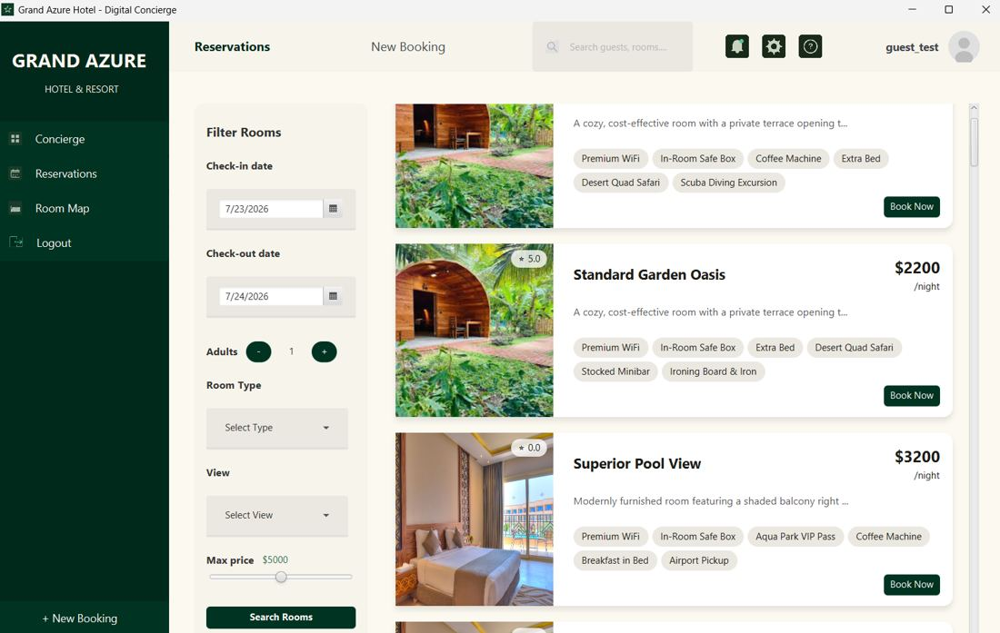
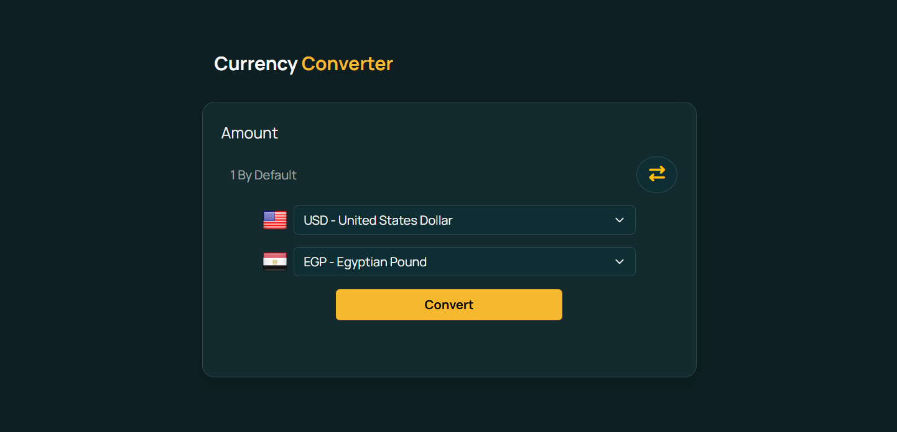
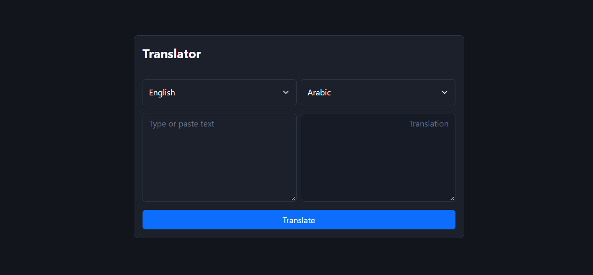
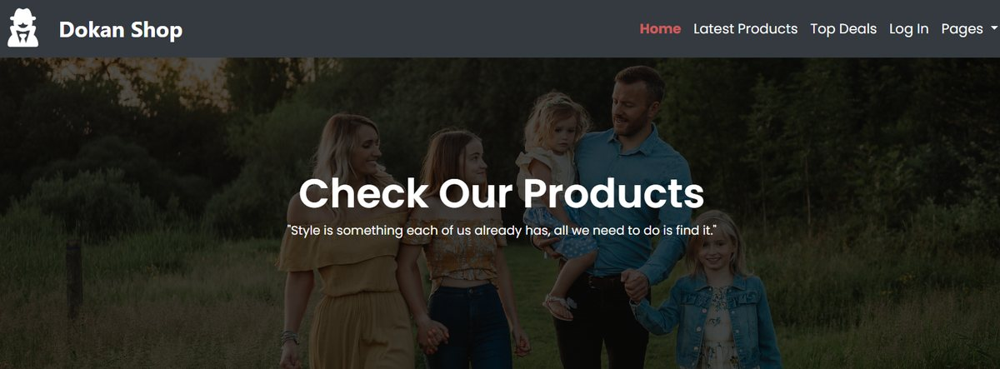

<p align="center">
  
</p>

<p align="center">
  <a href="https://portfolio-eight-green-36.vercel.app"></a>
  &nbsp;
  
  
  
  
</p>

<p align="center">
  <b>A fast, hand-written portfolio for a computer engineering student.</b><br>
  No frameworks, no build step. Just HTML, CSS and a little JavaScript.
</p>

---

## ✨ Overview

This is the personal portfolio of **Adam Elhessy**, a computer engineering student at **Ain Shams University**. It presents my projects, skills and education in a clean single-page layout, with smooth scroll animations and a working contact form.

| 🎯 Goal | 💡 How the site delivers it |
|:---|:---|
| Show real work | Six projects with screenshots, tech tags, live demos and source links |
| Feel polished | Scroll-reveal and hover animations, a floating profile photo, a responsive layout |
| Be easy to reach | A contact form, plus LinkedIn, GitHub and email buttons |
| Stay simple | Plain files, nothing to install, deploys by uploading the folder |

---

## 🚀 Projects Featured

### 🏨 Grand Azure Hotel Reservation System


> **Team project** · Ain Shams University · Spring 2026

An object-oriented hotel management system in Java covering the whole guest journey: room search, booking, invoices, check-in, payment and check-out.

- 🛠️ Built the **Admin** role with full create, read, update and delete over rooms, room types and amenities
- 🛎️ Wrote the **Receptionist** workflow and the amenity cost and revenue calculations
- 🐞 Helped debug the system across all layers

   

[](https://github.com/OmarFarouk-Code/Hotel_Reservation_System)

---

### 💊 Smart Pharmacy Management System
> **Team project in C++** · built with the **JAMBOY Team**

A menu-driven console application for pharmacy operations.

- 🔐 Manager and pharmacist logins with different permissions, limited to 3 attempts
- 📦 A 50-medicine inventory with low-stock alerts below 5 units
- 🧾 Multi-item billing with an automatic 10% discount on orders over 300 LE
- 💾 Everything saved to text files between sessions

  

[](https://github.com/adamelhessy/Pharmacy-Management-System)

---

### 💱 Currency Converter


Converts between **160+ world currencies** using live exchange rates, with country flags, a swap button and friendly error messages.

   

[](https://exchanger-beige.vercel.app) [](https://github.com/adamelhessy/currency-converter)

---

### 🌍 Translator


A simple browser app for translating text between languages: choose the two languages, type or paste text, press **Translate**.

  

[](https://translator-beige-iota.vercel.app) [](https://github.com/adamelhessy/translator)

---

### 🛍️ DOKAN Shop


A multi-page online shop front end with its own stylesheets, scripts and product pages, deployed live on Vercel.

  

[](https://dokan-shop-bay.vercel.app/) [](https://github.com/adamelhessy/DOKAN-SHOP)

---

## 🧭 What's On The Page

| Section | What you'll find |
|:---:|:---|
| 🏠 **Hero** | Name, role, short intro, quick facts and a portrait with an accent frame |
| 👤 **About** | Who I am and what I'm looking for |
| 🗂️ **Projects** | One large featured project and four smaller cards, each with an image |
| 🧰 **Skills** | Programming (Java, C++, OOP, JavaScript), Web (HTML5, CSS3, Bootstrap) and tools |
| 🎓 **Education** | B.Sc. Computer Engineering, Ain Shams University |
| 📬 **Contact** | GitHub, LinkedIn and email buttons, plus a message form |

---

## 🎬 Animations & Polish

- 🌅 **Hero intro**: the text fades up line by line when the page loads
- 🎈 **Floating portrait**: the photo and its frame drift gently together
- 🌊 **Scroll reveal**: sections and cards fade in one after another as you scroll
- 🖱️ **Hover effects**: cards lift, project images zoom slightly, buttons and tags rise
- ♿ **Reduced motion**: all animation switches off for visitors who prefer it
- 🖨️ **Print friendly**: everything is visible when printed

---

## 📬 Contact Form

The form sends messages straight to my inbox through [FormSubmit](https://formsubmit.co), so the site needs **no backend**.

1. A visitor fills in name, email and message and presses **Send message**.
2. The message is delivered to my email.
3. If sending fails, the visitor's email app opens with the message already written, so nothing is lost.

> ⚠️ **One-time setup:** the first submission triggers an activation email from FormSubmit. Click the link in it once and later messages arrive normally.

---

## 🧱 Project Structure

```
Portfolio/
├── index.html            page content
├── css/
│   ├── style.css         main design (colors, layout, typography)
│   └── animations.css    animations, project images, contact form, small-screen fixes
├── js/
│   └── main.js           scroll reveal + contact form logic
├── images/
│   ├── adam.jpg
│   ├── hotel-app.jpg
│   ├── pharmacy.svg
│   ├── currency-converter.png
│   ├── translator.png
│   └── dokan-shop.jpg
└── README.md
```

---

## 🛠️ Built With

<p align="center">
  <a href="https://skillicons.dev">
    
  </a>
</p>

- 🔤 **Fonts:** Bricolage Grotesque and Figtree from Google Fonts
- 🎨 **Design:** custom CSS with colour variables, grid and flexbox, fully responsive
- ⚙️ **Behaviour:** vanilla JavaScript (IntersectionObserver for scroll reveal)
- ☁️ **Hosting:** Vercel

---

## 🚀 Run & Deploy

```bash
# Get the code
git clone https://github.com/adamelhessy/Portfolio.git
cd Portfolio

# Preview: just open index.html in a browser
```

To publish, upload the folder to **Vercel**, **Netlify** or **GitHub Pages**. No build command is needed.

> 💡 Test the contact form on the live site rather than from a local file.

---

## 🧩 Customizing

| I want to change... | Edit |
|:---|:---|
| Text, projects, links | `index.html` |
| Colors, fonts, layout | `css/style.css` (colour variables are at the top) |
| Animations, form look | `css/animations.css` |
| Form behaviour, reveal timing | `js/main.js` |
| A project image | Save it in `images/` and change that project's `src` in `index.html` |

---

## 🔧 Improvements Made

- 📱 Fixed the header menu overflowing on phone screens
- 🛡️ Content can never stay hidden if the animation script fails to load
- ⚡ Images load lazily and the profile photo loads first
- 🔍 Added a page description, link-preview details and a browser tab icon
- ⌨️ Visible keyboard focus and descriptive image text for accessibility
- 🔗 All project links point to the correct repositories and live demos

---

## 🤝 Let's Connect

<p align="center">
  <a href="https://www.linkedin.com/in/adam-elhessy-818686384/"></a>
  &nbsp;
  <a href="https://github.com/adamelhessy"></a>
  &nbsp;
  <a href="mailto:adam.elhessy1122@gmail.com"></a>
</p>

---

## 🙌 Credits

- 💊 The **Smart Pharmacy Management System** was built as a team effort by the **JAMBOY Team**, whose name comes from the initials of the project's contributors.
- 🏨 The **Grand Azure Hotel Reservation System** was built with a team of five at Ain Shams University.
- 🔤 Fonts by Google Fonts, hosting by Vercel, contact form by FormSubmit.

<p align="center">
  
</p>
